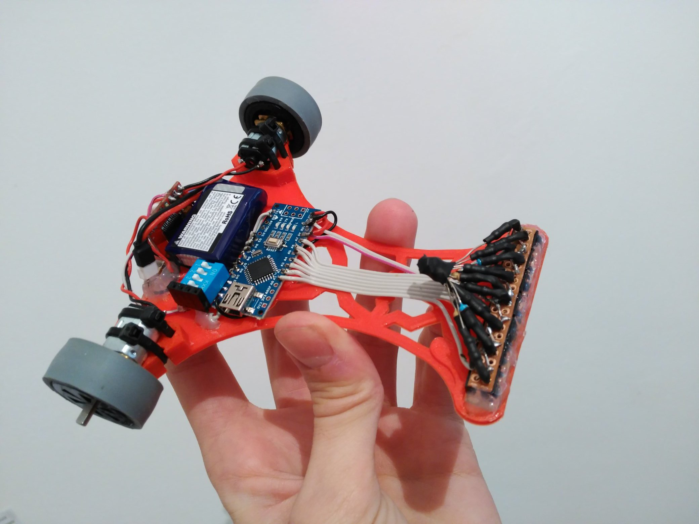
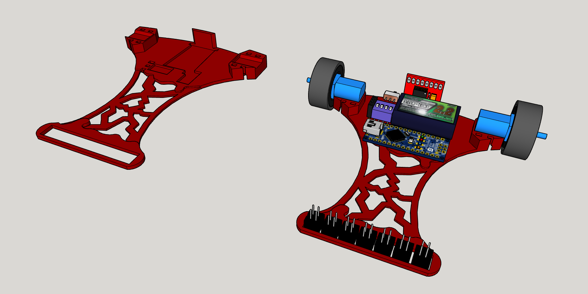

# AkainuBot

Robot siguelíneas básico con Arduino Nano, motores N20 y sensores CNY70.

## Hardware
- Arduino Nano
- Driver de motores TB6612FNG
- 2x Motores "Pololu" N20 @2000rpm
- DIP Switch 4p
- LiPo 2S ~250 mAh
- 7x Sensores CNY70
- 7x Resistencias 47kΩ
- 7x Resistencias 220Ω
- Goma de ruedas reciclada de rodillos de impresora
- Chasis completamente impreso en PLA

## Software
- Programado con Arduino IDE
- Funciones de PID y cálculo de posición en la línea
- Disponibles programas de siguelíneas y degradado (desuso)